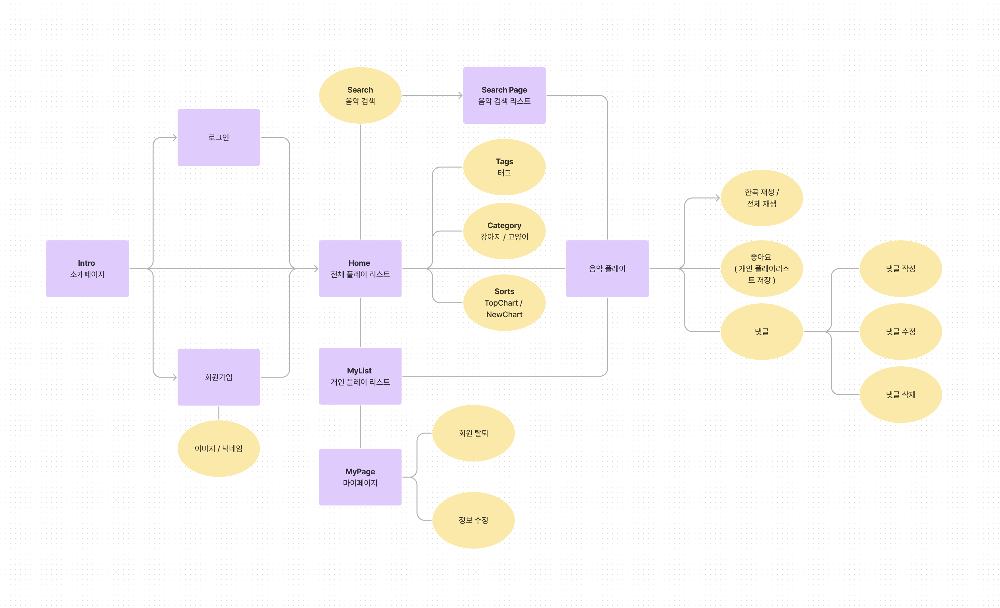
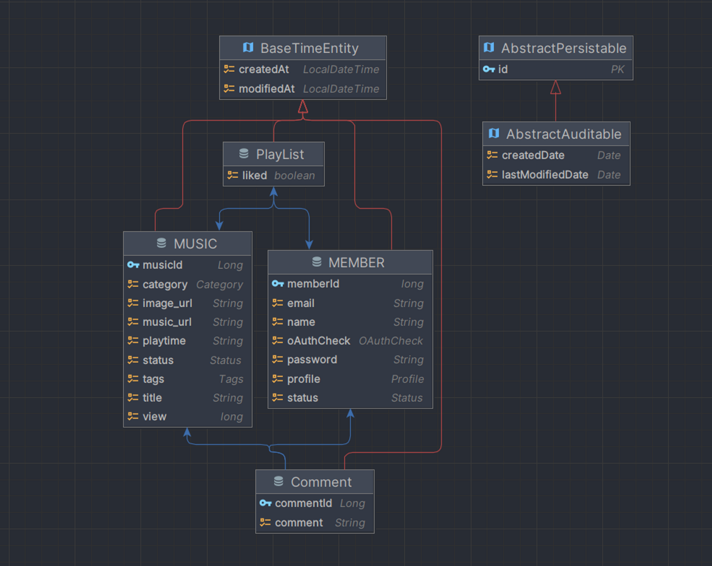

# </div>Team.닥트리오


## TEAM MEMBER
### Front-end

|  |  |  |
| ---------------------------------------------------------------------------------------------- | ---------------------------------------------------------------------------------------------- | ---------------------------------------------------------------------------------------------- |
| **임경섭**                                                                                   | 김동주                                                                                      | 김혜주                                                                                       |
| • Login, SignUp, Withdrawal<br> • OAuth(Google,Naver,Kakao)<br> • Responsive header<br> • Router                                                             |  • SideBar <br> • MyPage <br> • 프로필 수정                                                                                                                          | • Home page <br> • MyList page <br> • admin page <br> • music playlist <br> • music player <br>  • comment                                                                                                                            |

### Back-end
| |  |  |
| ------------------------------------------------------------------------------------------ | ------------------------------------------------------------------------------------------ | ------------------------------------------------------------------------------------------ |
| **신영호**                                                                              | 박경민                                                                                     | 홍준기                                                                                    |
| • 음악 CRUD<br> • 플레이리스트 CRUD<br> • GITHUB->docker->AWS CI/CD                                                             | • 회원 CRUD<br> • Spring Security(JWT, OAuth2)                                                              | • 댓글 CRUD                                                                |
### Special
|  |  |  |
| ------------------------------------------------------------------------------------------ | ------------------------------------------------------------------------------------------ | ------------------------------------------------------------------------------------------ |
| **소주**                                                                              | 베롱이                                                                                    | 커피                                                                                    |
| • 낮잠자기 <br> • 간식먹기 <br> • 앉아서 멍때리기                                                              | • 숨 쉬기<br> • 밥 잘먹기<br> • 책상에서 잠자기                                                              | • 똘망똘망한 눈  <br> • 냥냥펀치                                                                   |
## STACKS


<details>
  <summary><strong><h2>UserFlow</h2></strong></summary>
  <div>
    
  </div>
</details>

## 
<details>
  <summary><strong><h2>ERD</h2></strong></summary>
  <div>
    
  </div>
</details>

##

## API
> **<i class="fa fa-question-circle"></i> Link:** [펫플리 API 명세서](https://api.petpil.site:8080/docs/swagger-ui/index.html)
## FOLDER
```
Client
├─ .eslintrc.cjs
├─ .gitignore
├─ .prettierrc.cjs
├─ index.html
├─ package-lock.json
├─ package.json
├─ public
├─ src
│  ├─ assets
│  │  └─ imgs
|  |  └─ icons
│  ├─ components
|  |   └─ layouts
|  |   └─ commons
│  ├─ constants
│  ├─ hooks
│  ├─ pages
│  ├─ redux
│  ├─ styles
│  ├─ utils
│  ├─ App.css
│  ├─ App.tsx
│  ├─ index.css
│  ├─ main.tsx
└─ vite.config.js

Server
├─ logs
├─ src
│  ├─ docs
│  │  └─ asciidoc
|  |     └─ imdex.adoc
│  ├─ main
|  |  ├─ java
|  |  |  ├─ com.sebmain011.petplaylist
|  |  |  |  ├─ domain
|  |  |  |  |  ├─ comment
|  |  |  |  |  ├─ member
|  |  |  |  |  ├─ music
|  |  |  |  |  └─ playlist
|  |  |  |  └─ global
|  |  |  └─  PetplatListApplication.java
|  |  └─ resources
|  |     ├─ static.doxs
|  |     |   └─ admin
|  |     |      └─ index.html
|  |     └─ application.yml
│  └─ test
├─ .gitignore
├─ build.gradle
├─ Dockerfile
├─ Dockerfile_client
├─ gradlew
├─ gradlew.bat
└─ settings.gradle

```
